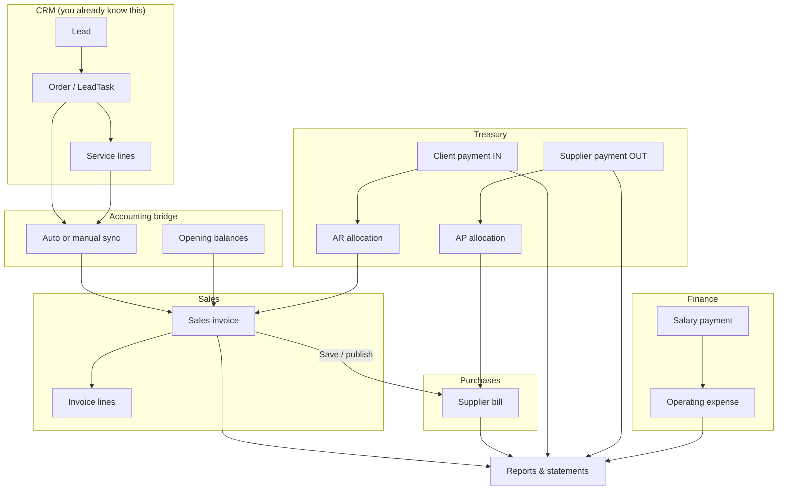

# Ghaith Accounting — Accountant User Guide

**Audience:** Main accountants who already use the CRM daily.  
**Scope:** The embedded accounting module at `/accounting/` — how data flows, what each screen does, and step-by-step procedures.

---

## Table of contents

1. [What this module is](#1-what-this-module-is)
2. [Getting in](#2-getting-in)
3. [Navigation map](#3-navigation-map)
4. [Big picture: how data flows](#4-big-picture-how-data-flows)
5. [Core concepts every accountant must know](#5-core-concepts-every-accountant-must-know)
6. [CRM ↔ Accounting bridge](#6-crm--accounting-bridge)
7. [Master data](#7-master-data)
8. [Sales invoices (revenue & receivables)](#8-sales-invoices-revenue--receivables)
9. [Supplier bills (costs & payables)](#9-supplier-bills-costs--payables)
10. [Treasury: cash, payments & allocations](#10-treasury-cash-payments--allocations)
11. [Operating expenses & payroll](#11-operating-expenses--payroll)
12. [Reports & statements](#12-reports--statements)
13. [Daily, weekly & month-end routines](#13-daily-weekly--month-end-routines)
14. [Go-live & historical data](#14-go-live--historical-data)
15. [Troubleshooting & FAQ](#15-troubleshooting--faq)
16. [Glossary](#16-glossary)

---

## 1. What this module is

Ghaith Accounting lives **inside the same system as the CRM**. It is not a separate product you log into differently — it is a finance workspace that:

- Receives **orders and services** from the CRM as sales invoices
- Tracks **what clients owe you** (accounts receivable)
- Tracks **what you owe suppliers** (accounts payable)
- Records **cash in and out** through money accounts and payments
- Records **operating expenses** (rent, utilities, salaries, etc.)
- Produces **reports, aging, trial balances, and statements**

**You already know the CRM:** leads, orders, services, suppliers, selling prices, “Issued”, “Send to client”, etc. This guide explains what happens **after** sales work is done in the CRM, and how your accounting actions can flow back to the CRM where relevant.

---

## 2. Getting in

### 2.1 Who can access accounting?

Only users marked as **Main accountant** (or Django superusers) can open `/accounting/`.

| Role | Where it is set | What you see |
|------|-----------------|--------------|
| **Main accountant** | Django Admin → User profiles → **Is main accountant** | “Accounting” link in CRM sidebar; full access to `/accounting/` |
| Other CRM users | — | No Accounting link; redirected if they try `/accounting/` directly |

> **Note:** The field “Is accountant” on user profiles does **not** grant access by itself. Only **Is main accountant** matters for the accounting module.

### 2.2 How to open accounting

1. Log in to the CRM as usual.
2. In the left sidebar, open **Tools → Accounting**.
3. You land on the **Dashboard** at `/accounting/`.

To return to the CRM at any time: sidebar → **Back to CRM**.

### 2.3 URLs you will use often

| Screen | URL |
|--------|-----|
| Dashboard | `/accounting/` |
| Invoices | `/accounting/sales/invoices/` |
| Payments | `/accounting/treasury/payments/` |
| Operating expenses | `/accounting/expenses/` |
| Salaries (payroll tab) | `/accounting/expenses/?tab=salaries` |
| Opening balances | `/accounting/bridge/opening-balances/` |
| AR aging | `/accounting/reporting/ar-aging/` |
| AP aging | `/accounting/reporting/ap-aging/` |

---

## 3. Navigation map

Accounting has **two levels** of navigation.

### 3.1 Left sidebar (main menu)

| Section | Item | Purpose |
|---------|------|---------|
| **Switch** | Back to CRM | Return to sales calendar / CRM |
| **Overview** | Dashboard | KPIs, charts, overdue alerts |
| | CRM invoice review | Review queue for CRM sync (legacy/manual workflow) |
| | Opening balances | Pre-go-live balances per client/supplier |
| **Sales** | Clients | Client master data |
| | Invoices | Sales invoices (revenue / A/R) |
| | Employees | Staff profiles & default salary |
| | Service types | Catalog synced from CRM |
| **Purchasing** | Suppliers | Supplier master data |
| | Supplier bills | Bills you owe suppliers (A/P) |
| **Treasury** | Money accounts | Cash boxes & bank accounts |
| | Payments | Money in / money out |
| **Finance** | Operating expenses | OPEX + Salaries tab |
| | Reports | Opens reporting hub |
| **Tools** | Admin | Django admin (staff only) |
| | Logout | Sign out |

### 3.2 Top hub tabs (Dashboard & Reports)

On the dashboard and all report pages, a **horizontal tab bar** groups related reports. Date filters (From / To / preset) carry across tabs when possible.

| Main tab | What it covers |
|----------|----------------|
| **Overview** | Dashboard home — revenue, profit, cash, overdue table |
| **Destinations** | Sales and profit broken down by destination |
| **Summary** | Period snapshot + shortcuts to key reports |
| **Receivables** | AR aging, all-clients statements, client list |
| **Payables** | AP aging, all-suppliers statements, supplier list |
| **Cash & expenses** | Cash movement, OPEX by category, expense list |
| **Trial balance** | Activity / P&L, clients TB, suppliers TB |
| **Salesman** | Per-employee performance reports |

**Export tip:** Most report pages support `?format=pdf` on the URL (or use the export buttons on list screens).

---

## 4. Big picture: how data flows

### 4.1 The lifecycle in one diagram



### 4.2 Plain-language summary

| Step | What happens |
|------|--------------|
| 1 | Sales team creates an **order** in the CRM with **service lines** (hotel, flight, visa, etc.). |
| 2 | If the order date is on or after the **go-live date**, the system creates an accounting **draft invoice** automatically. |
| 3 | You **review and save** the invoice in accounting — this **publishes** it and creates **supplier bills** for costs. |
| 4 | When the client pays, you record a **payment IN** — it is **allocated** to open invoices (reduces what they owe). |
| 5 | When you pay a supplier, you record a **payment OUT** — allocated to open bills. |
| 6 | Rent, utilities, and **salaries** go through **operating expenses** (salaries have their own tab). |
| 7 | **Reports** pull everything together in USD. |

### 4.3 What accounting does *not* do automatically

| Item | Behaviour |
|------|-----------|
| **Historical invoices** (before go-live) | Not auto-imported — use opening balances + optional manual sync per order |
| **Publishing invoices** | Draft invoices from CRM do **not** post supplier bills until you **save/publish** in accounting |
| **Salary payment** | Employee monthly salary is **not** auto-expensed — you prepare payroll rows and post each payment manually |
| **Client payments** | You must record payments; the system can auto-allocate but does not guess bank deposits |

---

## 5. Core concepts every accountant must know

### 5.1 Document statuses: DRAFT, POSTED, VOIDED

| Status | Meaning |
|--------|---------|
| **DRAFT** | Work in progress; editable; temporary document number (e.g. `TMP-…`, `TMP-OPEX-…`) |
| **POSTED** | Finalised; affects balances and reports; permanent number (e.g. `INV-2026-…`, `PAY-…`) |
| **VOIDED** | Cancelled; no longer active; kept for audit trail |

**Important exception — sales invoices:** Both **DRAFT and POSTED** invoices count toward **client balances and client statements**. A CRM-synced invoice sitting in draft still shows as money the client owes until you void it or it is fully paid. This is intentional so receivables are visible while you finish editing.

### 5.2 Document numbers

| Document | Draft number | Posted number |
|----------|--------------|---------------|
| Sales invoice | `TMP-…` | `INV-YYYY-…` |
| Supplier bill | `TMP-…` | `BIL-…` |
| Payment | (created posted in normal flow) | `PAY-…` |
| Operating expense | `TMP-OPEX-…` | `OPEX-YYYY-…` |

### 5.3 Everything reports in USD

The dashboard, aging, trial balances, and statements use **USD** as the reporting currency.

| Document | How USD is calculated |
|----------|----------------------|
| **Sales invoice** | `exchange_rate_to_usd` × line amounts. For USD invoices, rate = 1. |
| **Operating expense** | Same pattern: `amount_usd = amount × rate` |
| **Supplier bills (from invoices)** | Stored in USD from line cost |
| **Payments** | Amount in payment currency; exchange rate used when payment currency ≠ money account currency |
| **Opening balances** | Always entered in **USD** (debit_usd / credit_usd) |

When you edit a non-USD invoice, always confirm the **exchange rate** before saving.

### 5.4 Allocations (matching payments to documents)

An **allocation** links a payment to an invoice or bill.

| Type | Links | Effect |
|------|-------|--------|
| **AR allocation** | Client payment **IN** → sales invoice | Reduces invoice balance (client owes less) |
| **AP allocation** | Supplier payment **OUT** → supplier bill | Reduces bill balance (you owe less) |

**Auto-allocation:** When you create or edit a posted payment, the system tries to allocate to the **oldest open** invoices/bills first (by due date).

**Unallocated balance:** If a client pays more than their open invoices, the remainder is **prepayment / credit** on their account. Same idea for supplier overpayments.

**Manual allocation:** Use the allocation forms under Treasury when you need to match a specific invoice or split across documents.

### 5.5 CRM flags on invoice lines (two-way sync)

Each invoice line can carry CRM-related flags:

| Accounting field | CRM meaning | Why it matters |
|------------------|-------------|----------------|
| **Issued** (`crm_issued`) | Service marked “Issued” in CRM | **Supplier statements only show issued lines** |
| **Send to client** | “Send to client” in CRM | Client-facing / package behaviour |
| **Issue price** | CRM issue price | Can override net cost for supplier cost |

These flags sync **both ways** with a “sticky OR” rule: once set in either system, a CRM refresh will not accidentally clear them.

---

## 6. CRM ↔ Accounting bridge

### 6.1 Go-live date (`Invoice sync from`)

In Django Admin → **Accounting integration settings**:

- **Invoice sync from** — orders **before** this date are **not** auto-synced to accounting.
- **Master data sync enabled** — keeps clients, suppliers, destinations, service types, and employees in sync when CRM records change.

**Why this exists:** On go-live day you do not want years of old CRM orders flooding accounting. Instead you enter **opening balances** for what clients/suppliers owed as of that date.

### 6.2 What syncs automatically

| CRM event | Accounting result |
|-----------|-------------------|
| User saved | Employee profile created/updated |
| CRM supplier saved | Accounting supplier created/updated |
| CRM service type saved | Catalog service type created/updated |
| Order (LeadTask) saved | Master data synced; invoice created/refreshed if eligible |
| Service line added/changed/deleted | Linked invoice lines refreshed |
| Accounting line flags changed | Pushed back to CRM service row |

**Clients** are created from **orders** (when a lead is linked to an order), not from every raw lead in the pipeline.

### 6.3 Auto-sync vs manual sync

| Situation | What to do |
|-----------|------------|
| Order date **on or after** go-live, has services | Invoice appears automatically as **draft** (`TMP-…`) |
| Order date **before** go-live | No auto invoice — enter **opening balance** for that client/supplier; optionally **Sync with accounting** on the CRM order |
| Order missing from accounting | Open the CRM order → **Sync with accounting** (main accountant only) |

### 6.4 CRM invoice review queue

**Path:** Sidebar → **CRM invoice review** (`/accounting/bridge/review/`)

This screen lists sync queue items. New eligible orders are usually auto-approved today; the queue is mainly for oversight, older items, or manual approve/reject workflow.

| Action | Result |
|--------|--------|
| **Approve** | Creates or refreshes draft invoice; can optionally publish |
| **Reject** | Marks rejected with notes |

### 6.5 Opening balances

**Path:** Sidebar → **Opening balances** (`/accounting/bridge/opening-balances/`)

Use this for **pre-go-live history** — what clients and suppliers owed (or prepaid) before you started live invoice sync.

#### How to add an opening balance

1. Click **Add opening balance** (or equivalent new link).
2. Choose **party type**: Client or Supplier.
3. Select the **client** or **supplier**.
4. Set **as of date** — typically your go-live date.
5. Enter **debit** and/or **credit** in USD (at least one must be non-zero).

#### Debit vs credit cheat sheet

| Party | Debit (USD) means | Credit (USD) means |
|-------|-------------------|---------------------|
| **Client** | They **owe you** (A/R) | **Prepayment / credit** (they paid ahead) |
| **Supplier** | You **paid on account** / reduction | You **owe them** (A/P) |

#### On statements

Opening balances appear as a line with reference **`OPEN`** at the top of client/supplier statements.

> **Tip:** Opening balances are included on statements when the opening `as_of_date` is on or before the statement period **end** date — not hidden when your statement starts earlier in the year.

---

## 7. Master data

Master data is the foundation: clients, suppliers, employees, service types, destinations, expense categories.

### 7.1 Clients

**Path:** `/accounting/clients/`

| Task | Steps |
|------|-------|
| **Find a client** | Use search on the list; export PDF if needed |
| **Create manually** | New client → fill code, type (Individual/Corporate), names, phone, email, passport → Save |
| **Edit** | Open client → update fields → Save |
| **Quick create from invoice** | On invoice form → “Add client” modal (creates without leaving the invoice) |

Most clients are **created automatically** when CRM orders sync. You edit them in accounting to fix spelling, add passport details, etc.

### 7.2 Suppliers

**Path:** `/accounting/suppliers/`

| Task | Steps |
|------|-------|
| **View list with balance** | List shows each supplier’s current A/P balance |
| **Create** | New supplier → code, name, type (Airline, Hotel, DMC, Visa, etc.) → Save |
| **Detail** | Click supplier → see balance and linked activity |
| **Deactivate** | Use deactivate when you no longer use them (cannot delete if in use) |

Supplier types help organise reporting; they do not change posting logic.

### 7.3 Employees

**Path:** `/accounting/employees/`

| Field | Purpose |
|-------|---------|
| Name, role, start date | Staff record |
| **Monthly salary (USD)** | Default amount when you **prepare payroll rows** — **not** auto-paid |
| Active flag | Inactive employees are skipped for payroll prep |

**Salary PDF:** From employee edit/list → download salary PDF for a given month (informational receipt).

### 7.4 Service types & destinations

**Path:** `/accounting/catalog/service-types/`

Synced from CRM service names. Accountants can add or edit types directly when needed.

Destinations are created from CRM order destination strings and used on invoice lines for reporting (e.g. dashboard **Destinations** tab).

### 7.5 Expense categories

**Path:** `/accounting/expenses/categories/`

Categories classify operating expenses (Rent, Utilities, Salaries, etc.).

- Category **SALARY** is created automatically for payroll payments.
- You can add categories on the fly from the expense form.

---

## 8. Sales invoices (revenue & receivables)

Sales invoices are the **centre of revenue recognition** and **accounts receivable**.

**Path:** `/accounting/sales/invoices/`

### 8.1 Where invoices come from

| Source | Typical state when you see it |
|--------|------------------------------|
| **CRM auto-sync** | Draft, `TMP-…` number, lines pre-filled from services |
| **Manual create** | Empty draft you build from scratch |
| **Adjustment** | Correction invoice after voiding an old posted invoice |

### 8.2 Invoice header fields (what to check)

| Field | Guidance |
|-------|----------|
| **Client** | Required before publish |
| **Sales employee** | Required; drives salesman reports |
| **Issue date** | Invoice date |
| **Currency & exchange rate** | Confirm rate for non-USD |
| **Main destination** | Optional; helps destination reporting |

### 8.3 Invoice lines (service rows)

Each line typically has:

| Field | Source / meaning |
|-------|------------------|
| Service type | From CRM service name |
| Supplier | Who you buy from |
| Destination | Travel destination |
| Line employee | Who sold / handled the line |
| Service date / due date | When service occurs; due date drives aging |
| Sell price | What you charge the client |
| Cost price | What you pay the supplier |
| Discount | Line-level discount |
| Notes | Details, voucher numbers, etc. |
| **Issued** | Must be on for supplier statement visibility |
| **Send to client** | CRM package flag |

### 8.4 Step-by-step: process a CRM-synced invoice

1. Open **Invoices** and look for `TMP-…` drafts (new CRM orders).
2. Open the invoice **Edit** screen.
3. Verify **client**, **sales employee**, and **currency/rate**.
4. Review each line: sell price, cost, supplier, dates, **Issued** flag.
5. Fix anything the CRM did not have (e.g. missing supplier).
6. Click **Save**.

**On save (publish):**

- Status becomes **POSTED**
- Number becomes `INV-YYYY-…`
- USD amounts are recalculated
- **Supplier bills** are auto-created and posted (one bill per supplier, for lines with cost > 0)

There is no separate “Post” button on invoices — **Save = publish**.

### 8.5 Step-by-step: create a manual invoice

1. Invoices → **+ New invoice**
2. Select client, employee, dates, currency
3. Add lines (service type, supplier, prices, etc.)
4. **Save** to publish

### 8.6 View, PDF, void, delete, adjust

| Action | When to use |
|--------|-------------|
| **Open / view** | Read-only view with totals |
| **PDF** | Client copy or accountant copy (`?version=client` or `accountant`) |
| **Void** | Cancel invoice — **blocked if payments are already allocated** |
| **Delete** | Only draft or voided, no allocations |
| **Adjust** | Accounting/Admin: voids original and creates correction draft for posted invoice errors |

### 8.7 What happens after publish (supplier side)

When you publish an invoice, the system:

1. Groups lines by **supplier**
2. For each supplier with **cost > 0**, creates a **posted supplier bill** in USD
3. Links each bill line to the sales invoice line

You normally **do not** need to manually create bills for standard package sales.

---

## 9. Supplier bills (costs & payables)

**Path:** `/accounting/purchases/bills/`

### 9.1 Where bills come from

| Source | Notes |
|--------|-------|
| **Auto from invoice publish** | Most common — one bill per supplier |
| **Manual entry** | For costs not tied to a client invoice |

### 9.2 Bill lifecycle

| Status | What you can do |
|--------|-----------------|
| **DRAFT** | Edit lines, amounts, dates |
| **POSTED** | Affects AP balances; allocate payments against it |
| **VOIDED** | Cancelled |

Manual bills: create → edit → **Post** (assigns `BIL-…` number).

Auto-created bills from invoices are usually already **POSTED** when created.

### 9.3 Step-by-step: record a manual supplier bill

1. Supplier bills → **+ New bill**
2. Select supplier, date, currency (if applicable)
3. Add lines with descriptions and amounts
4. **Save** draft
5. **Post** when ready

### 9.4 Supplier statements vs client statements

| Statement | Which lines appear |
|-----------|-------------------|
| **Client** | All active invoice lines (draft + posted) |
| **Supplier** | Only lines where **Issued** is checked |

Always mark services **Issued** in CRM or accounting when the supplier has actually issued the ticket/voucher and you recognise the payable.

---

## 10. Treasury: cash, payments & allocations

Treasury is where **money moves**.

### 10.1 Money accounts

**Path:** `/accounting/treasury/accounts/`

| Type | Examples |
|------|----------|
| **Cash** | Office cash box, petty cash |
| **Bank** | Bank accounts |

Each account has a **currency**. Payments must be compatible with the account currency (exchange rate entered when they differ).

**Step-by-step: add a money account**

1. Money accounts → **+ New**
2. Name, type (Cash/Bank), currency
3. Save

### 10.2 Payments overview

**Path:** `/accounting/treasury/payments/`

| Direction | Party | Meaning |
|-----------|-------|---------|
| **IN** | Client | Client paid you — reduces A/R |
| **OUT** | Supplier | You paid supplier — reduces A/P |
| **OTHER** | — | Non-AR/AP movement (no auto-allocation) |

**Normal flow:** Creating a payment **auto-posts** it and **auto-allocates** to open documents.

### 10.3 Step-by-step: record a client receipt

1. Payments → **+ New payment**
2. Direction: **IN**
3. Party type: **Client** → select client
4. Money account: which cash/bank received the money
5. Date, currency, amount
6. If payment currency ≠ account currency, enter **exchange rate**
7. Optional note
8. **Save**

**System then:**

- Assigns `PAY-…` number and posts payment
- Auto-allocates to oldest open invoices for that client
- Any leftover = **client credit / prepayment**

### 10.4 Step-by-step: record a supplier payment

Same as client receipt, but:

- Direction: **OUT**
- Party type: **Supplier**
- Auto-allocates to oldest open **supplier bills**

### 10.5 Editing a posted payment

You can edit posted payments. The system will:

- Clear allocations if you change the party
- Trim allocations if you reduce the amount
- Re-run auto-allocation

Always review allocations after editing.

### 10.6 Manual allocations

Use when auto-allocation is wrong (client paid for a specific invoice only, partial splits, etc.):

| Form | Path |
|------|------|
| AR allocation | `/accounting/treasury/allocations/ar/new/` |
| AP allocation | `/accounting/treasury/allocations/ap/new/` |

### 10.7 Other treasury tools

| Tool | Purpose |
|------|---------|
| **Bank/cash reconciliation** | Compare system balance vs physical/bank count |
| **Inter-account transfer** | Move money between your own accounts |
| **Payment receipt PDF** | Printable receipt per payment |

---

## 11. Operating expenses & payroll

**Path:** `/accounting/expenses/`

Two tabs: **Other expenses** and **Salaries**.

### 11.1 Other operating expenses

For rent, utilities, office costs, marketing, etc. — **not** tied to a client invoice.

#### Step-by-step: record an operating expense

1. Operating expenses → **+ New Expense**
2. Category, date, currency, amount, description
3. Attach files if needed (PDF, images)
4. **Save** (draft, `TMP-OPEX-…`)
5. **Post** when ready → `OPEX-YYYY-…`, affects P&L reports

| Status | Actions |
|--------|---------|
| DRAFT | Edit, post, add/remove attachments |
| POSTED | Void if entered in error |
| VOIDED | No further changes |

Salary-linked expenses **do not** appear on this tab (they are managed under Salaries).

### 11.2 Salaries (payroll) — important

**Employee monthly salary on the employee profile is NOT automatically expensed.** This is deliberate: real payroll often includes partial payments, overdue catch-up, and bonuses.

#### Payroll concepts

| Term | Meaning |
|------|---------|
| **Salary row** | One employee × one month — tracks what is due vs paid |
| **Amount due** | Base salary + bonus for that month |
| **Payment** | Actual money paid (can be less, equal, or more than due) |
| **Status** | Open → Partially paid → Settled |

Each salary **payment** creates a **posted operating expense** (category: Salaries).

#### Step-by-step: monthly payroll

1. Go to **Operating expenses** → **Salaries** tab  
   URL: `/accounting/expenses/?tab=salaries&payroll_month=YYYY-MM`
2. Select the **payroll month** (top filter).
3. Click **Prepare rows for YYYY-MM**  
   - Creates one row per **active** employee with **monthly salary > 0**  
   - Copies `monthly_salary` as **base**; bonus starts at 0  
   - Does **not** create expenses yet
4. For each employee, click **Pay / edit**.
5. On the salary screen:
   - **Adjust amounts:** change base, add **bonus**, add notes → **Save amounts**
   - **Record payment:** enter **amount paid**, **payment date**, optional note → **Post payment**
6. Repeat until all employees are settled (or left partial if still owing).

#### Partial pay example

| Field | Value |
|-------|-------|
| Base salary | 1,500 |
| Bonus | 200 |
| **Due** | 1,700 |
| Payment 1 (mid-month) | 1,000 → status **Partial**, balance 700 |
| Payment 2 (month-end) | 700 → status **Settled** |

Each payment creates its own `OPEX-…` line in reports.

#### Where salary expenses appear

| Report / screen | Visible? |
|-----------------|----------|
| Activity trial balance / P&L | Yes (Salaries category) |
| OPEX by category | Yes |
| **Other expenses** tab | **No** (filtered out to avoid duplicates) |
| Salaries tab payment history | Yes |

#### Optional: command-line prepare (admin/cron)

```bash
python manage.py post_employee_salaries --month 2026-06
```

Same as “Prepare rows” in the UI — still **no automatic payment**.

---

## 12. Reports & statements

Access via sidebar **Reports** or dashboard hub tabs. Use **date filters** at the top; add `?format=pdf` to export.

### 12.1 Dashboard (`/accounting/`)

| Area | Content |
|------|---------|
| KPI cards | Revenue, gross/net profit, A/R, A/P, cash in/out |
| Charts | Sales trend, profit, cash, AR aging, OPEX, salesman, destinations |
| Overdue table | Clients with overdue invoice balances — action list for collections |
| Tabs | Overview, Destinations, Summary |

### 12.2 Receivables reports

| Report | URL | What it shows |
|--------|-----|---------------|
| **AR aging** | `/accounting/reporting/ar-aging/` | Outstanding invoice balances by age bucket |
| **All clients SOA** | `/accounting/reporting/statements/clients/all/` | Summary balance per client |
| **Client statement** | `/accounting/reporting/client-statement/<id>/` | Full SOA: OPEN row, each service line (debit), payments (credit), running balance |

**Client statement notes:**

- Draft + posted invoices both appear
- Lines with future service dates may be highlighted as **pending**
- Opening balance shows as **OPEN**

### 12.3 Payables reports

| Report | URL | What it shows |
|--------|-----|---------------|
| **AP aging** | `/accounting/reporting/ap-aging/` | Outstanding bill balances by age |
| **All suppliers SOA** | `/accounting/reporting/statements/suppliers/all/` | Summary per supplier |
| **Supplier statement** | `/accounting/reporting/supplier-statement/<id>/` | Only **Issued** lines; costs as credits, payments as debits |

### 12.4 Cash & expenses reports

| Report | What it shows |
|--------|---------------|
| **Cash movement** | Expected balance per money account |
| **OPEX by category** | Posted operating expenses grouped by category (USD) |

### 12.5 Trial balance / P&L

| Report | What it shows |
|--------|---------------|
| **Activity trial balance** | Income statement style: revenue (401), COGS (501), each OPEX line (632), gross & net profit |
| **Clients trial balance** | Per client: opening, period movement, closing A/R |
| **Suppliers trial balance** | Per supplier: opening, movement, closing A/P |

### 12.6 Salesman reports

**Path:** Hub → **Salesman** tab

1. Pick an employee
2. **Brief** — summary: services, clients, revenue, profit
3. **Detailed** — line-by-line per invoice

Use for commission calculations and performance review.

---

## 13. Daily, weekly & month-end routines

### 13.1 Daily checklist

| # | Task | Where |
|---|------|-------|
| 1 | Check overdue receivables | Dashboard table |
| 2 | Review new `TMP-…` invoices from CRM | Invoices list |
| 3 | Complete & save pending invoices | Invoice edit |
| 4 | Record client receipts | Payments → IN |
| 5 | Record supplier payments | Payments → OUT |
| 6 | Enter any petty-cash expenses | Operating expenses |

### 13.2 Weekly checklist

| # | Task | Where |
|---|------|-------|
| 1 | AR aging review | Receivables → AR aging |
| 2 | AP aging review | Payables → AP aging |
| 3 | Cash position | Cash movement |
| 4 | Reconcile cash accounts | Treasury → Reconcile |
| 5 | Chase clients with overdue balances | Client statements |

### 13.3 Month-end checklist

| # | Task | Where |
|---|------|-------|
| 1 | Prepare payroll month | Expenses → Salaries → Prepare rows |
| 2 | Post each salary payment | Salary entry screens |
| 3 | Post any remaining draft OPEX | Operating expenses |
| 4 | Activity trial balance / P&L | Trial balance tab |
| 5 | Clients & suppliers trial balances | Trial balance sub-tabs |
| 6 | Salesman reports (if commissions due) | Salesman tab |
| 7 | Spot-check key client & supplier SOAs | Statement reports |

---

## 14. Go-live & historical data

For the **first time** accounting goes live in production:

### 14.1 One-time setup (admin / IT)

| Step | Action |
|------|--------|
| 1 | Deploy code & run migrations |
| 2 | Set **Invoice sync from** to go-live date (Django admin) |
| 3 | Run `python manage.py sync_crm_to_accounting` (master data from orders) |
| 4 | Mark accountant users as **Is main accountant** |

### 14.2 One-time setup (accountant)

| Step | Action |
|------|--------|
| 1 | Enter **opening balances** for every client/supplier with pre-go-live balance |
| 2 | Verify opening rows appear on statements (`OPEN`) |
| 3 | For important old orders: CRM → **Sync with accounting** (optional) |
| 4 | From go-live forward: process new CRM drafts daily |

### 14.3 After go-live

| Event | Expected behaviour |
|-------|-------------------|
| New CRM order (on/after go-live) | Draft invoice auto-created |
| CRM order edited | Invoice lines refresh (unless voided) |
| Old order | No auto sync — opening balance + manual sync only |

---

## 15. Troubleshooting & FAQ

### “I don’t see Accounting in the CRM sidebar”

Your user profile needs **Is main accountant** checked in Django admin. Log out and back in after the change.

### “CRM order exists but no accounting invoice”

| Cause | Fix |
|-------|-----|
| Order date before go-live | Manual **Sync with accounting** on CRM order, or rely on opening balance |
| No service lines on order | Add services in CRM first |
| Sync disabled | Check Accounting integration settings |

### “Client balance looks wrong”

1. Run **client statement** for the full period
2. Check for **OPEN** opening row
3. Remember **draft invoices count** toward balance
4. Check for **unallocated payments** (prepayment credit)
5. Check payment allocations on Treasury

### “Supplier statement missing a line”

The line is probably not marked **Issued**. Edit the invoice line in accounting or check **Issued** in CRM, then save.

### “Cannot void invoice”

Payments are allocated to it. Void or reallocate payments first, or use **Adjust** for corrections.

### “Salary did not appear in operating expenses list”

Salary payments appear under **Salaries** tab and in OPEX reports — they are hidden from **Other expenses** to avoid double listing.

### “Opening balance missing on statement”

Confirm `as_of_date` is on or before the statement **end** date. Re-run statement with correct date range.

### “Amounts don’t match CRM selling price”

Accounting uses its own invoice lines after sync. CRM edits re-sync on save, but always verify on the accounting invoice edit screen before publishing.

---

## 16. Glossary

| Term | Definition |
|------|------------|
| **A/R** | Accounts receivable — money clients owe you |
| **A/P** | Accounts payable — money you owe suppliers |
| **Allocation** | Linking a payment to a specific invoice or bill |
| **Bridge** | CRM ↔ accounting sync layer |
| **COGS** | Cost of goods sold — supplier costs on sales |
| **Draft** | Unpublished document; may still affect client A/R for invoices |
| **Go-live date** | `Invoice sync from` — start of automatic invoice sync |
| **Issued** | Flag that supplier has issued service; required on supplier SOA |
| **OPEX** | Operating expense — rent, salaries, utilities, etc. |
| **Publish** | Finalise a sales invoice (Save on invoice form) |
| **SOA** | Statement of account |
| **Sync** | Copy/update CRM data into accounting |
| **TMP number** | Temporary draft document number before posting |

---

## Quick reference card

```
CRM order (with services)
    → Draft invoice (TMP-…)
    → You Save
    → Posted invoice (INV-…) + supplier bills (BIL-…)

Client pays
    → Payment IN (PAY-…)
    → Auto-allocated to invoices

You pay supplier
    → Payment OUT (PAY-…)
    → Auto-allocated to bills

Monthly salary
    → Salaries tab → Prepare rows
    → Edit base/bonus → Post payment
    → OPEX expense (not in Other expenses tab)

Pre-go-live history
    → Opening balances (OPEN on statements)
```

---

*Document version: June 2026 — matches Ghaith-CRM embedded accounting module.*
